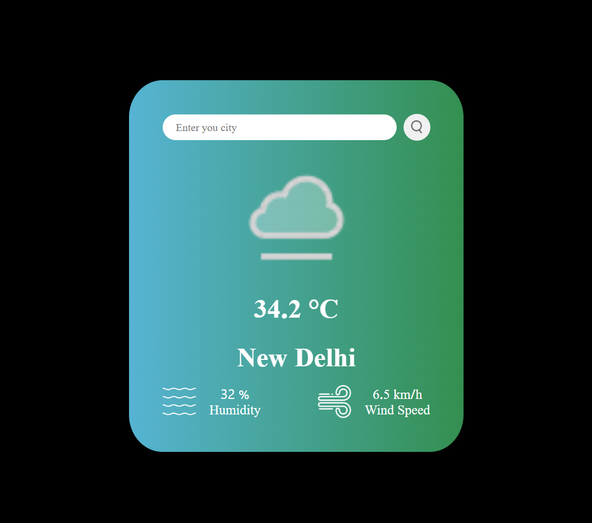

# 🌤️ Weather App

A simple and elegant weather application that fetches and displays real-time weather data based on user input or automatically detected location. Built using **HTML**, **CSS**, **JavaScript (ES6 modules)**, and powered by **WeatherAPI** and **IPAPI.co**. Deployed via **GitHub Pages** using **Vite** and **GitHub Actions**.

## ✨ Features

- 🌍 Auto-detects your city using IP geolocation from [ipapi.co](https://ipapi.co/).
- 🔍 Search for weather by city name.
- 🌡️ Displays:
  - Temperature (in °C)
  - Humidity (%)
  - Wind speed (km/h)
  - Weather condition icon
- 🎨 Responsive, modern UI with a gradient background.
- ⚙️ Deployed with GitHub Actions CI/CD to GitHub Pages.

## 🚀 Demo

[Live Weather App 🚀](https://abhijitsinha-dev.github.io/Weather-App/)

## 🧰 Tech Stack

- **Frontend**: HTML, CSS, JavaScript (ES6)
- **Build Tool**: [Vite](https://vitejs.dev/)
- **APIs**:
  - [WeatherAPI](https://www.weatherapi.com/) — for weather data
  - [IPAPI.co](https://ipapi.co/) — for user location detection
- **CI/CD**: GitHub Actions
- **Hosting**: GitHub Pages

## 📸 Screenshots

## 🔐 Environment Variables via GitHub Secrets

In GitHub repository:

1. Go to **Settings > Secrets and Variables > Actions**.
2. Add a new secret:
   - Name: `API_KEY`
   - Value: your [WeatherAPI](https://www.weatherapi.com/) key

GitHub Actions will inject this during the build process.

## 📝 License

This project is licensed under the MIT License.

---
